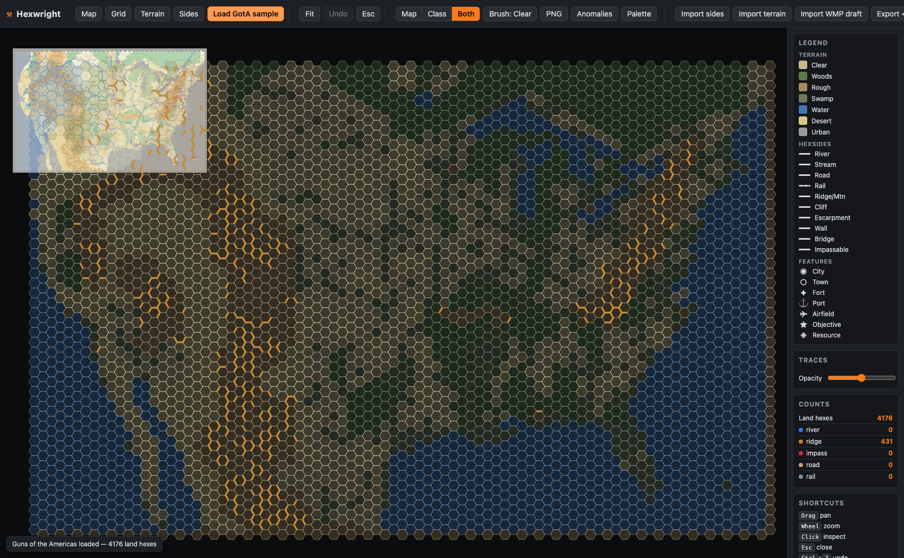

<div align="center">

# Hexwright

**An engine-agnostic hex-map terrain/feature editor. Zero build, vanilla JavaScript + Canvas2D.**

Load a hex map, assign each hex's terrain, its in-hex features, and its multi-feature hexsides by hand,
and export the canonical `hexgrid` / `terrain` / `hexsides` JSON your game reads.




</div>

## Ray — open a project and touch up hexsides (start here)

1. **Double-click** `Launch Hexwright - Napoleon at Bay.command` **or** `Launch Hexwright - TWU East Prussia.command` (in this folder). Your browser opens with the map raster and every hexside layer already loaded — nothing to import.
2. **Pick a project** by launching the one you want; each launcher opens straight into that map. (The plain `Launch Hexwright.command` opens the start screen with no project loaded.)
3. **Fix a hexside:** click **Edges** on the left rail, pick an ink in the Brush card (Primary/Secondary River, Primary/Secondary Road, Bridge on NaB; River / Rail / Border / Impassable on TWU), then click a hexside line to add it — or **Alt-click** a line to remove it. (Or use **Inspect**: click a hex, then tap one of its 6 edges and toggle a feature.) **Middle-mouse drag pans in any mode** — left-drag keeps painting while a paint tool is active. A hexside on the map's outer edge has no hex on the other side and can't carry a feature; the status bar says so if you click one.
4. **Export** your work: click **Export ▾** (top-right) → **hexsides.json**. Do this before closing — the exported file is your durable copy. The editor also autosaves about a second after every change (any project with terrain **or** hexside content) and offers to restore on the next launch; a regular browser refresh is safe and always loads current editor code.
5. **Where it lands:** `~/Downloads/hexsides.json`. To push your edits back into the game, run `python3 from_hexwright.py` inside that game's `tools/terrain-extraction/hexsides/` folder — it rewrites the game's river/road/rail/border/impassable files from your export.

## Contents

- [What it is](#what-it-is)
- [Why](#why)
- [Quick start](#quick-start)
- [Features](#features)
- [Edge paint quick use](#edge-paint-quick-use)
- [Data model](#data-model)
- [Bring your own game](#bring-your-own-game)
- [WMP pipeline](#wmp-pipeline-auto-guess-then-refine)
- [TWU pipeline (rivers + rail)](#twu-pipeline-rivers--rail)
- [Testing](#testing)
- [License](#license)

## What it is

Open a map, see its hex grid, click a hex. Set the hex's base terrain, toggle in-hex features
(city, town, fort, port, objective...), and set what each of its six edges carries. Hexsides hold
several features at once, so a single edge can be both a river and a road. Edges are shared, so
assigning one also assigns it for the neighbor. Export the result as the JSON files your engine loads.

It is the deliberate, human-in-the-loop alternative to auto-detecting this from a scan. You already
know where the rivers and ridges go; Hexwright lets you say so quickly, and check your work at a glance.

## Why

Auto-snapping hand-traced features to hexsides is brittle: a meandering printed river sits well off
the clean geometric edges, so proximity matching fails. A human-in-the-loop editor is what real
wargame studios use. It is deterministic, correct, and reusable, and it doubles as the correction
surface for any project whose auto-digitized terrain needs fixing. When a classifier can produce a
rough first pass (see the [WMP pipeline](#wmp-pipeline-auto-guess-then-refine)), Hexwright imports it
as an editable draft you refine.

## Quick start

Zero build, no runtime dependencies. From the repo root:

```
npm run serve          # or: python3 -m http.server 8000
# open http://localhost:8000  ->  "Load GotA sample"
```

The sample loader needs the local server for `fetch`; the file pickers work either way.

## Features

- **Base terrain** per hex, from a configurable palette.
- **In-hex features** (city, town, fort, port, airfield, objective, resource...), multiple per hex.
- **Multi-feature hexsides** — each edge can carry several features at once (a stream *and* a road).
  They render distinctly: **edge features** (river, ridge, cliff) run as lines *along* the edge, while
  **crossings** (road, rail, bridge) draw as short rungs *across* the edge midpoint, so a road that
  crosses a river reads at a glance. The inspector groups the two kinds accordingly.
- **View modes** — *Map* (scan + reference traces), *Classification* (data only, no photo), *Both*.
- **Overlay export** — render the current classification to a PNG at the source-map resolution, so you
  can drop it beside the scan and spot mistakes.
- **Anomaly check** — highlight unclassified hexes, orphan hexsides, and unconfirmed *draft* hexes.
- **Configurable palette** — terrain, features, hexside features, kinds, and colors live in a JSON
  config; any game supplies its own vocabulary. The bundled default is GotA's (`palettes/gota.json`).
- **WMP draft import** — ingest a wargame-map-parser classification as a low-confidence draft to refine.
- **TWU on-ramp** — import TWU `rivers.json` (`hexsides` pair-arrays) and `rail.json` (`links` pair-arrays or `{a,b}` objects) with strict validation and loud errors, then export TWU-exact files (`rivers.json` + `rail.json` with `hexes` endpoint union).
- **Reference trace overlays** with opacity control, brush drag-assign, edge-paint drag-assign, undo/redo, and a palette-driven legend.
- **Session autosave** — your work persists to `localStorage` on every change and restores on the next
  visit, so an accidental reload never loses hand-assignment work.

- **Overlay opacity slider** — fade the terrain-fill wash in Both view so the scan stays
  traceable underneath; hexsides, grid, and traces keep full strength. Dragging it from any
  view switches you to Both (it never silently no-ops).
- **Nudge map alignment** (`n`) — drag the scan under the fixed digital grid, or arrow keys
  for 1-px steps (Shift = ×10). The offset autosaves with the project: align once, aligned
  forever. The pragmatic answer to calibration drift — move the imagery, keep the hex data
  canonical.
- **In-app help** (`?`) — full guide + shortcut table from the toolbar.
- **Double-click launcher** (`Launch Hexwright.command`, macOS) — starts the local server
  (from the PARENT folder, so gitignored `local/` manifests can reference sibling-repo
  full-resolution maps that must not enter this public repo) and opens the editor; boots
  straight into `local/gota-fullres.json` when present via the `?project=<manifest>` URL
  parameter.

## Edge paint quick use

Turn on **Edge paint** (`e`), pick a hexside feature chip, then paint directly on map edges.

- **Click** toggles the active feature on the nearest valid shared edge.
- **Drag** paints (set-on) across edges; one drag stroke is one undo entry.
- **Alt+click / Alt+drag** erases the active feature from hit edges.
- Edge paint takes pointer priority while enabled; turn it off and normal pan/inspect behavior returns.

| Shortcut | Action |
| --- | --- |
| `Drag` | Pan |
| `Wheel` | Zoom |
| `Click` | Inspect hex |
| `e` | Toggle edge paint mode |
| `b` | Toggle brush mode |
| `v` | Cycle view mode |
| `1`-`0` | Quick terrain select |
| `Esc` | Close inspector |
| `Ctrl/Cmd + Z` | Undo |

## Data model

A project is flat-top even-q, addressed by CCRR hex codes (`"0803"` = column 08, row 03).

- **`hexgrid`** — grid calibration (the hex-to-pixel formula + image dimensions).
- **`terrain`** — `{"terrain": {"CCRR": terrainKey}}`; one base terrain per hex.
- **`hexsides`** (exported) — grouped by layer for back-compatibility:
  `{"rivers":[{a,b}], "roads":[...], "mountains":[...], ...}`, each shared edge stored once with `a<b`.
  An edge carrying several features appears in each of its layers. Untouched layers such as `theaters`
  and `boundaries` survive a load/export round-trip verbatim.
- **`hexFeatures`** — `{"CCRR": ["city", ...]}` in-hex point features.

Internally hexsides are per-edge feature arrays; the grouped shape is the export contract.

## Bring your own game

Hexwright is data-contract driven. To onboard a new game you provide a grid JSON, a palette JSON, and a project manifest.

- **Grid contract (`hexgrid`)**: include the flat-top even-q calibration fields Hexwright reads (`x_model.x_intercept_col0`, `x_model.col_pitch_x`, `y_model.y_intercept_row0`, `y_model.row_pitch_y`, `y_model.even_col_down_offset`, or equivalent legacy aliases) plus `image_full` when available.
- **Palette contract**: define `terrain`, `hexFeatures`, and `hexsideFeatures` in JSON. Each hexside feature needs `key`, `kind` (`edge` or `crossing`), color, and optional `exportLayer`/aliases.
- **Manifest contract**: `name`, `map`, `hexgrid`, `terrain`, optional `hexsides`, optional `traces`, optional `imageFull`, optional `palette`.

Manifest example:

```json
{
  "name": "My Game",
  "map": "assets/board-web.jpg",
  "imageFull": [5000, 3200],
  "hexgrid": "data/hexgrid.json",
  "terrain": "data/terrain.json",
  "hexsides": "data/hexsides.json",
  "palette": "palettes/my-game.json"
}
```

Load a manifest directly at boot with `?project=<manifest-url>`, for example:

- [http://localhost:8000/hexwright/?project=samples/twu-project.json](http://localhost:8000/hexwright/?project=samples/twu-project.json)

## WMP pipeline (auto-guess, then refine)

[wargame-map-parser](https://github.com/lerugray/wargame-map-parser) can classify hex-fill terrain
from a scan. Its output already uses the same CCRR addressing:

```
python -m parser.export_hexwright wmp-terrain.json -o gota-terrain.hexwright.json
```

In Hexwright, **Import WMP draft** loads that file, marks every imported hex as an unconfirmed *draft*
(visible in the Anomaly overlay), and you refine + confirm from there. The full loop:
scan -> WMP rough classify -> Hexwright hand-refine -> canonical export.

## TWU pipeline (rivers + rail)

TWU on-ramp scope is intentionally narrow: rivers + rail only (no fortress import/export path).

1. Keep `hexwright` and `twu-deluxe-digital` as sibling checkouts.
2. Start the server from the parent directory so sibling paths resolve:

   ```
   cd ..
   python3 -m http.server 8000
   ```

3. Open Hexwright with the TWU template manifest:

   ```
   http://localhost:8000/hexwright/?project=samples/twu-project.json
   ```

4. Update `samples/twu-project.json` paths to match your local TWU repo layout.
5. Use **Import TWU layer** for each source file (`rivers.json`, then `rail.json`).
6. Refine by hand with edge paint.
7. Use **Export -> TWU rivers+rail** to write:
   - `rivers.json`: `_comment` + `hexsides: [["a","b"], ...]`
   - `rail.json`: `_comment` + `links: [["a","b"], ...]` + `hexes` endpoint union

Validation is strict and loud: wrong-shaped TWU files fail import with an explicit status error and no data changes.

## Testing

```
npm test               # headless Playwright suites: load / assign / export / round-trip / UI / autosave
```

## License

[MIT](LICENSE) © Ray Weiss
